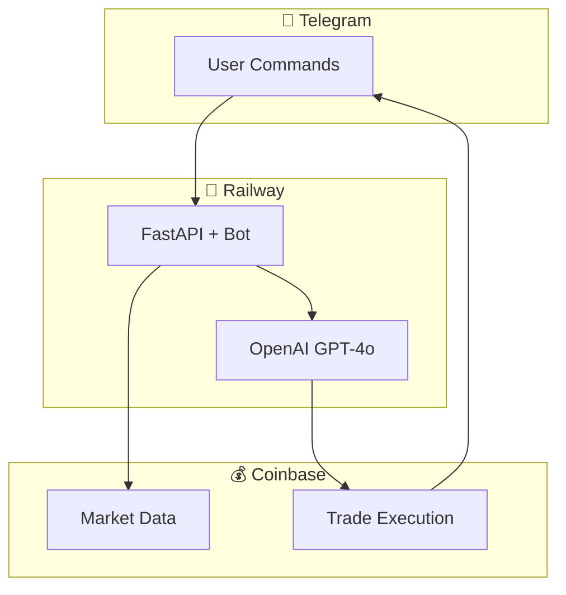

<p align="center">
  <h1 align="center">🤖 QuantSignals Bot</h1>
</p>

<p align="center">
  <b>AI-powered crypto day trading assistant via Telegram.</b>
</p>

<p align="center">
  
  
  
  
  
</p>

---

## 📋 Overview

QuantSignals Bot is an AI-powered Telegram bot that generates trading signals and executes trades on Coinbase. It uses GPT-4o to analyze market data and provide day trading recommendations.

### Features

- 🤖 **AI Trading Signals** - GPT-4o analyzes market data
- 📊 **Real-time Market Data** - Live prices from Coinbase
- 💰 **Auto Trade Execution** - One-click trading via Telegram
- 📈 **P&L Tracking** - Daily profit/loss monitoring
- 🛑 **Risk Management** - Configurable stop-loss/take-profit
- 🔔 **Telegram Alerts** - Instant notifications

---

## 🤖 Bot Commands

| Command | Description |
|---------|-------------|
| `/start` | Welcome message |
| `/signals` | Generate AI trading signals |
| `/market` | Quick market overview |
| `/balance` | Check account balances |
| `/portfolio` | View open positions |
| `/pnl` | Today's profit/loss |
| `/settings` | View bot settings |
| `/help` | Show help |

---

## 🚀 Quick Start

### 1. Create Accounts

- **Telegram Bot**: Message [@BotFather](https://t.me/BotFather) → `/newbot`
- **Coinbase**: Sign up at [coinbase.com](https://coinbase.com)
- **OpenAI**: Get API key at [platform.openai.com](https://platform.openai.com)

### 2. Get Coinbase API Keys

1. Go to [Coinbase Advanced](https://www.coinbase.com/settings/api)
2. Click **New API Key**
3. Select permissions:
   - ✅ View
   - ✅ Trade
4. Save the **API Key** and **Secret**

### 3. Deploy to Railway

[](https://railway.app/template)

### 4. Set Environment Variables

| Variable | Description |
|----------|-------------|
| `BOT_TOKEN` | Telegram bot token |
| `BASE_URL` | Railway public URL |
| `WEBHOOK_SECRET` | Any secret string |
| `OPENAI_API_KEY` | OpenAI API key |
| `COINBASE_API_KEY` | Coinbase API key |
| `COINBASE_API_SECRET` | Coinbase API secret |
| `TRADE_AMOUNT_USD` | Amount per trade (default: 10) |
| `MAX_POSITIONS` | Max open positions (default: 3) |
| `STOP_LOSS_PCT` | Stop loss % (default: 5) |
| `TAKE_PROFIT_PCT` | Take profit % (default: 10) |

### 5. Set Bot Commands

Message @BotFather:
```
/setcommands

start - Welcome message
signals - AI trading signals
market - Market overview
balance - Account balances
portfolio - Open positions
pnl - Today's P&L
settings - Bot settings
help - Show help
```

---

## 🏗️ Architecture



---

## ⚠️ Risk Warning

**Trading involves significant risk:**

- Never trade more than you can afford to lose
- Start with small amounts ($10-20 per trade)
- AI signals are not guaranteed to be profitable
- Past performance doesn't indicate future results
- This bot is for educational purposes

---

## 📊 Trading Pairs

Default supported pairs:
- BTC-USD (Bitcoin)
- ETH-USD (Ethereum)
- SOL-USD (Solana)
- AVAX-USD (Avalanche)
- LINK-USD (Chainlink)

---

## 🔒 Security

- API keys stored as environment variables
- Webhook protected by secret token
- No keys in source code
- Use API keys with **only trade permission** (no withdrawal)

---

## 📝 License

For educational purposes only. Not financial advice.

---

## 👤 Author

**Lesley Lloredia**
- GitHub: [@lloredia](https://github.com/lloredia)
